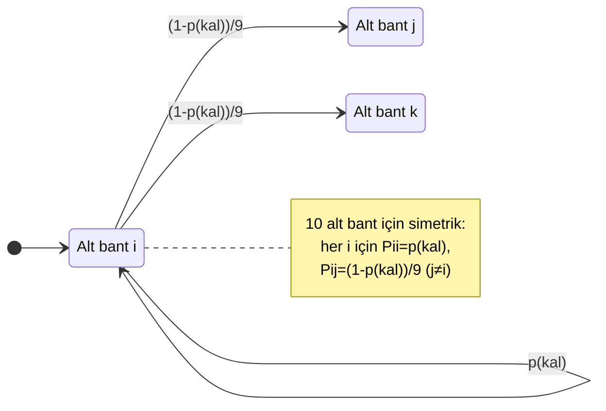
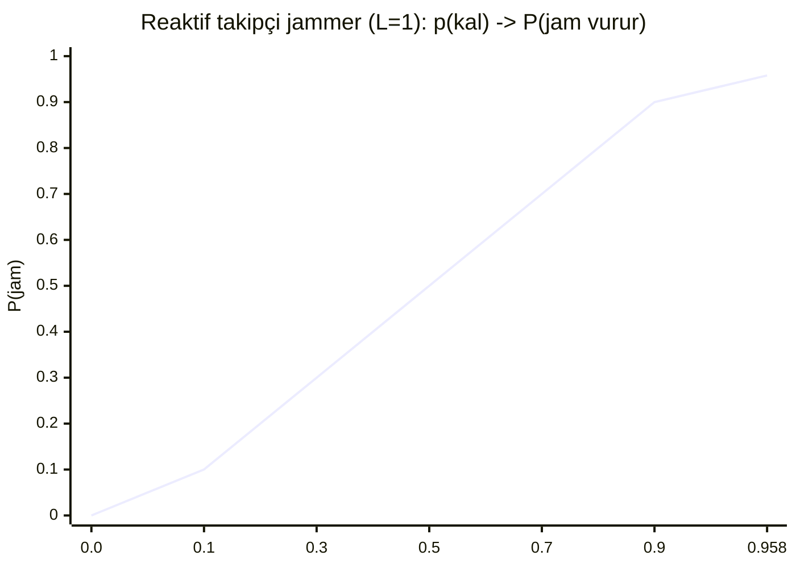

# Frekans-Çevik Radarlar İçin Alt Bant Seçiminde Olasılıksal Modeller ve Markov-Zinciri Tabanlı p(kal)/p(geç) Analizi

## Yürütücü Özet

Bu rapor, **10 alt bant** (subband) ve her alt bantta **24 sıralı kod** (4! permütasyon; toplam 240 alt-bant–kod kombinasyonu) bulunan bir frekans-çevik radar sisteminde, “aynı alt bantta kalma” olasılığı **p(kal)** ile “başka alt banda geçme” olasılığı **p(geç)**’in nasıl modellenebileceğini ve tipik politika aileleri altında nasıl türetilebileceğini inceler. Temel yaklaşım, alt bant seçimini **Markov zinciri / yarı-Markov / MDP–POMDP** çerçeveleriyle ifade etmek; sonra jamming (karıştırma) riski ve geçiş maliyeti gibi metriklere göre **duyarlılık (sensitivity) analizi** yapmaktır.  

Frekans çevikliği; hedef RCS (radar kesit alanı) sönümlerini ve glint etkilerini azaltarak tespit/izleme performansını iyileştirebilir ve düşmanın karıştırma gücünü tek bir taşıyıcı frekansta yoğunlaştırmasını zorlaştırır. citeturn5view0turn5view1 Ayrıca taşıyıcı frekansın **mikrosaniyeler mertebesinde** kaydırılabildiği örnekler raporlanmıştır; bu, “sık geçiş yapmanın” zaman maliyetini bazı platformlarda çok düşük kılar. citeturn5view0 Bununla birlikte, frekans çevikliği özellikle darbe/pulse düzeyinde uygulandığında **faz sürekliliğini (coherence)** bozabilir; pratikte faz telafisi ve benzeri işlemlerle yeniden koherent işlemleme gerekebilir. citeturn13view0turn8view0

Alt bant seçimi problemi yalnızca ECCM bağlamında değil, **spektrum paylaşımı** bağlamında da ele alınır: radarın bant içi parazit yoğunluğunu ölçüp (pasif izleme), beklenen girişimi minimize edecek bir **alt bant (β ≤ B, f_SB)** seçmesi; ancak bu izleme sırasında radar faaliyetlerinin durması gibi operasyonel maliyetleri vardır. citeturn5view2

Jammer (karıştırıcı) modelleri p(kal) için kritik belirleyicidir. Örneğin:
- **Sabit spot jammer** (tek alt banda sürekli basan) altında, istasyoner politikalarla p(kal) değişse bile alt banda düşme olasılığı çoğu simetrik tasarımda yaklaşık **1/10** kalır; bu durumda p(kal) daha çok **geçiş maliyetini** azaltmak için artırılabilir.
- **Reaktif/takipçi jammer** (gecikmeli izleyip aynı banda kilitlenen) altında, p(kal) büyüdükçe jammer’ın “yakalama” olasılığı çok hızlı artabilir; bu da yüksek p(kal)’ı riskli hale getirir. Benzer kanal-sıçramalı savunmaların tarayıcı jammer’a karşı Markovyen modellerle analiz edildiği literatürde gösterilmiştir. citeturn21view0
- Daha ileri durumda “bilişsel” jammer’lar, Markov karar süreçleri ve derin RL ile frekans seçimini optimize ederek, rastgele çevikliği bile yüksek başarıyla baskılayabilen senaryolar raporlanmıştır. citeturn22view0

Kod kitabı (24 kod) boyutu, **alt-bant geçiş olasılığını** her zaman doğrudan değiştirmez; fakat özellikle **yalnızca kod değiştirerek** aynı alt bantta daha uzun süre çeşitlilik sağlayabilen politikalar (örn. kod döngüsü) üzerinden p(kal)’ı fiilen büyütebilir. Ayrıca aldatma (deception) türü jammer’larda, jammer’ın doğru kodu **tahmin etme olasılığı** yaklaşık **1/24** mertebesine düşebileceğinden, kod kitabı boyutu aldatma riskini çarpan olarak azaltabilir. Kod tabanlı frekans-atlamalı dizilerin (Costas/permutasyon yapıları) radar dalga biçimi tasarımında tarihsel rolü literatürde vurgulanır. citeturn10view0

## Problem Tanımı ve Parametreleştirme

Sistem şu şekilde soyutlanır:

- Alt bant sayısı: $B = 10$  
- Kod sayısı (alt bant başına): $C = 24$ (4! permütasyon)  
- Karar anı: $t = 0,1,2,\dots$ (bir “dwell”, bir darbe, bir CPI içi alt-darbe kümesi vb. seçime göre tanımlanabilir; raporda açık parametre)  
- Seçilen alt bant: $b_t \in \{1,\dots,10\}$  
- Seçilen kod: $c_t \in \{1,\dots,24\}$

Birçok pratik tasarımda alt bant **kanallara bölünür** ve radar her iletimde mevcut kanallardan birini seçer; seçim darbe başına ya da demet/beam konumu başına yapılabilir. citeturn26view1

Bu raporda **radar dalga biçimi**, **dwell süresi**, **jammer tipi**, **karar politikası** bilinmeyen (açık) parametrelerdir. Bu nedenle sonuçlar:
1) kapalı-form olasılık türetimleri,
2) parametre süpürmeleri (p(kal), geçiş maliyeti, jammer gecikmesi vb.),
3) duyarlılık yorumları
şeklinde sunulur.

## Markov-Zinciri ve İlgili Stokastik Formülasyonlar

Alt bant seçimi için en temel model, birinci dereceden (memory-1) Markov zinciridir:

$$
\mathbb{P}(b_{t+1}=j \mid b_t=i) = P_{ij}, \quad i,j \in \{1,\dots,10\}.
$$

Burada “aynı alt bantta kalma” olasılığı,
$$
p_{\text{kal}} = \mathbb{P}(b_{t+1}=b_t)=\sum_{i=1}^{10} \pi_i P_{ii}
$$
olup $\pi$ istasyoner dağılımdır (varsa).

Kod boyutunu da içeren daha ayrıntılı modelde durum,
$$
x_t = (b_t, c_t) \in \{1,\dots,10\}\times\{1,\dots,24\}
$$
olur ve toplam durum sayısı $10\times 24 = 240$’tır. Bu iki seviyeli model, alt bant geçişlerini “kod üzerinden marjinalleştirerek” çıkarma imkânı verir:

$$
\mathbb{P}(b_{t+1}=j \mid x_t=(i,k))=\sum_{\ell=1}^{24}\mathbb{P}(x_{t+1}=(j,\ell)\mid x_t=(i,k)).
$$

**Bellek derecesi** politika türüne göre değişir:
- Tam rastgele seçim (bağımsız örnekleme) **memoryless** (Markov-0) gibi davranır.
- “p ile kal, 1−p ile değiş” türü politikalar **Markov-1**’dir.
- Kodları “tekrar etmeyecek şekilde” (without-replacement) seçmek, ya da “24 kodu bitirince alt bant değiştir” gibi döngüsel tasarımlar, alt bant seviyesinde bakıldığında **yüksek dereceli** (hatta yarı-Markov) bellek üretir; çünkü bir sonraki alt bant kararı “kaçıncı koddayız?” bilgisini gerektirir.

**Yarı-Markov (semi-Markov) yaklaşımı**, dwell süresinin (aynı alt bantta kaç adım kalındığı) geometrik değil de tasarıma/karara bağlı dağıldığı durumlar için uygundur. Bu ayrıca reaktif jammer gecikmesi gibi zaman ölçeklerini modele eklemeyi kolaylaştırır. Kanal-atlamalı savunmaların tarayıcı jammer’a karşı Markovyen biçimde modellenmesi örnekleri, radar benzeri spektrum-seçim süreçlerinin de Markov çerçevesiyle ele alınabileceğini gösterir. citeturn21view0

Aşağıdaki mermaid diyagramı, 10-alt-bant simetrik Markov zincirinin “her durumdan kendine döngü + diğerlerine eşit olasılıkla geçiş” yapısını şematik olarak gösterir.



## Ortak Politikalarda Geçiş Olasılıklarının Analitik Türetilmesi

Bu bölüm, p(kal) ve p(geç) için kapalı-form ifadeleri, önce alt bant seviyesinde sonra (gerekirse) kod dahil edilerek verir.

### Uniform rastgele alt bant seçimi

Her adımda alt bant bağımsız ve uniform seçilsin:

$$
\mathbb{P}(b_{t+1}=j)=\frac{1}{10}, \quad \forall j.
$$

Bu durumda
$$
p_{\text{kal}}=\mathbb{P}(b_{t+1}=b_t)=\frac{1}{10},\qquad p_{\text{geç}}=\frac{9}{10}.
$$

Bu, ITU-R’nin frekans-atlamalı radarlar için “mevcut kanallardan rastgele seçim” tanımına uygun bir sıçrama paradigmasıdır. citeturn26view1

### Zorunlu hop (aynı alt bant yasak)

Birçok FH (frequency hopping) tasarımında “aynı kanalda art arda kalmama” tercih edilebilir. Bu durumda:

$$
\mathbb{P}(b_{t+1}=b_t)=0,\quad \mathbb{P}(b_{t+1}=j\neq b_t)=\frac{1}{9}.
$$

Dolayısıyla $p_{\text{kal}}=0$, $p_{\text{geç}}=1$.

### “p ile kal, 1−p ile değiş” (simetrik Markov-1)

En yaygın parametrik Markov zinciri:

$$
P_{ii}=p,\qquad P_{ij}=\frac{1-p}{9}\ (j\neq i).
$$

Burada doğrudan:
$$
p_{\text{kal}} = p,\qquad p_{\text{geç}} = 1-p.
$$

Bu zincir simetrik olduğundan istasyoner dağılım $\pi_i=1/10$ olur; yani alt bantların uzun dönem kullanım oranı eşit kalır (politikaya ek bir “yasaklı bant” kuralı koymadıkça).

Aynı modelin dwell (aynı alt bantta kalma süresi) dağılımı geometriktir:
$$
\mathbb{P}(R=r)=(1-p)p^{r-1},\quad \mathbb{E}[R]=\frac{1}{1-p}.
$$
Bu ilişki, jammer gecikmesi/dwell süresi duyarlılık analizinde ana araçtır.

### Kod kitabı dâhil: Uniform (alt bant, kod) seçimi

Her adımda 240 durum (10×24) uniform seçilsin:

$$
\mathbb{P}(x_{t+1}=(j,\ell))=\frac{1}{240}.
$$

Alt bant marjinali:
$$
\mathbb{P}(b_{t+1}=j)=\sum_{\ell=1}^{24}\frac{1}{240}=\frac{24}{240}=\frac{1}{10}.
$$

Dolayısıyla p(kal) yine **0.1**’dir. Bu önemli bir sonuçtur: **Kod kitabının 24 olması**, simetrik ve bağımsız uniform örnekleme altında alt bant “kal/ geç” olasılıklarını **tek başına** değiştirmez; kod kitabı daha çok *alt bant değiştirmeden çeşitlilik* sağlama (ve aldatmaya karşı ek belirsizlik) üzerinden etkiler.

Eğer yalnızca “aynı (alt bant,kod) çiftini tekrar seçmek yasak” denirse:
$$
p_{\text{kal}}=\frac{24-1}{240-1}=\frac{23}{239}\approx 0.0962.
$$

### Kod kitabı döngüsü (cycling) ve p(kal)’ın kod-boyutu ile büyümesi

Birçok uygulamada kodlar deterministik bir sırayla çevrilir; alt bant sabit kalıp kod döner. Örneğin “aynı alt bantta 24 kodun tamamı kullanılsın, sonra alt bant değişsin” politikası:

- Durdurma koşulu: her alt bantta $L=24$ adım “iç döngü”
- 24 adımın 23’ünde alt bant aynı kalır, 1’inde değişir

Uzun dönem için:
$$
p_{\text{kal}}=\frac{L-1}{L}=\frac{23}{24}\approx 0.9583,\qquad p_{\text{geç}}=\frac{1}{24}\approx 0.0417.
$$

Bu, kod kitabı boyutunun p(kal)’ı **dolaylı olarak** yukarı çektiği tipik örnektir: kod kitabı ne kadar büyükse (L büyür), alt bant değiştirmeden daha uzun süre “çeşitlilik” sağlanabilir.

### Ödül-tabanlı / anti-jam stratejiler: MDP–POMDP bağlamı

Gerçekte alt bant seçimi çoğu zaman “rasgele” değildir; radar çevresini algılar ve karar verir. Spektrum paylaşımı literatüründe, radarın pasif izleme ile bant içi paraziti ölçüp beklenen girişimi minimize edecek alt bant seçimine yönelmesi; fakat izleme sırasında radarın durması ve zamanlamanın kritik olması vurgulanır. citeturn5view2

Bu tür kararlar genellikle bir **MDP** ya da kısmi gözlemlilik nedeniyle **POMDP** olarak modellenir. Radar–jammer etkileşiminin POMDP niteliği ve tarihçe (history) kullanımı gibi yaklaşımlar açıkça tartışılmıştır. citeturn8view2 Aynı şekilde, radar dalga biçimi/enerji dağıtımı gibi kararların MDP ile modellenip derin RL ile optimize edildiği çalışmalar mevcuttur. citeturn23view0turn8view4

Bu çerçevede sık kullanılan iki politika formu:

**Yumuşakmaks (softmax) + geçiş maliyeti (inertia)**
$$
\pi(j\mid i, \mathbf{u}) \propto \exp\left(\frac{u_j-\kappa\cdot \mathbb{1}[j\neq i]}{\tau}\right)
$$
Burada:
- $u_j$: alt bant j’nin algılanan faydası (örn. SINR, düşük jammer riski, spektrum boşluğu)
- $\kappa$: alt bant değiştirmenin cezası (zaman/enerji/koherens kaybı)
- $\tau$: “sıcaklık” (rastgelelik düzeyi)

Koşullu p(kal):
$$
p_{\text{kal}}(\mathbf{u})=\pi(i\mid i,\mathbf{u})
=\frac{\exp(u_i/\tau)}{\exp(u_i/\tau)+\sum_{j\neq i}\exp((u_j-\kappa)/\tau)}.
$$
Bu ifade, **$\kappa$ artınca** ve/veya **$\tau$ azalınca** p(kal)’ın artacağını analitik olarak gösterir.

**Epsilon-greedy + kalma olasılığı**
$$
\pi = (1-\epsilon)\cdot \text{greedy} + \epsilon\cdot \text{uniform}
$$
Bu formda p(kal), “greedy kararın mevcut alt bantla çakışma olasılığı” ile “uniform kısımda tekrar seçilme olasılığı (1/10)” bileşenlerinin toplamıdır; ancak fayda sürecinin dinamiğine bağlı olduğundan kapalı-form genellikle $\mathbf{u}_t$ modelini gerektirir.

## Geçiş Maliyeti, Tespit Performansı ve Karıştırma Riski Metrikleri

Alt bant seçimi yalnızca olasılık değil, çok hedefli optimizasyon problemidir. Burada üç metrik ailesi önerilir.

### Alt bant değiştirme maliyetleri

**Zaman/boşluk (settling time) maliyeti.** Bir kanaldan diğerine geçerken donanımın yeniden ayarlanması nedeniyle kısa bir süre iletim/işleme yapılamayabilir. Kablosuz sistemler literatüründe bu “settling time” ve senkron kaybının throughput maliyeti olarak modellenmesi ve örneğin belirli bir yonga için ~7.6 ms mertebesinde olabileceği raporlanır. citeturn7view0 Radar özelinde ise taşıyıcının mikrosaniyelerde kaydırılabildiği örnekler, geçiş maliyetinin platforma bağlı olarak çok küçük olabileceğini gösterir. citeturn5view0 Bu nedenle rapor, geçiş süresini $\Delta t$ olarak açık parametre alır ve $\Delta t/T_{\text{dwell}}$ oranı üzerinden duyarlılık analizi yapar.

**Koherens/işleme maliyeti.** Frekans çevikliği, pulse’lar arası faz sürekliliğini bozarak koherent entegrasyonu zorlaştırabilir; literatürde bu tür dalga biçimlerinde rastgele menzil ve Doppler faz dalgalanmalarının giderilmesi için telafi/yöntemler geliştirilmiştir. citeturn13view0turn8view0 Bu, “sık alt bant değiştirmenin” sadece RF yeniden ayar maliyeti değil, **algoritmik** maliyeti de olabileceğini ima eder.

**Algılama (sensing/monitoring) maliyeti.** Spektrum paylaşımında pasif izleme radar ön-uçlarını kullanır ve izleme sırasında radar operasyonları durabilir; bu açık bir fırsat maliyetidir. citeturn5view2

### Tespit performansı metriği: SNR hedefi ve Albersheim yaklaşımı

Tespit başarımını, belirli bir yanlış alarm olasılığı $P_{FA}$, hedef tespit olasılığı $P_D$ ve entegrasyon darbe sayısı $N$ için gerekli **SNR** üzerinden modellemek pratik bir mühendislik yaklaşımıdır. citeturn19view0

Albersheim yaklaşımı (nonfluctuating hedef, noncoherent entegrasyon) ile gerekli tek-örnek SNR (dB) yaklaşık olarak:

$$
A=\ln\left(\frac{0.62}{P_{FA}}\right),\quad
B=\ln\left(\frac{P_D}{1-P_D}\right),
$$
$$
\chi_{dB}=-5\log_{10}N+\left(6.2+\frac{4.54}{\sqrt{N+0.44}}\right)\log_{10}(A+0.12AB+1.7B).
$$
citeturn19view0

Bu raporda tespit metriği iki biçimde kullanılır:
1) **Hedef SNR marjı:** $M = \text{SNR}_{\text{etkin}} - \chi_{dB}(P_D^\*,P_{FA},N)$  
2) **SJNR/SINR bazlı ödül:** RL/MDP çalışmalarında sıklıkla ödül fonksiyonu olarak kullanılır. citeturn23view0turn8view4

### Karıştırma riski metrikleri: spot, tarama, reaktif ve bilişsel jammer

**Spot jammer (sabit):** jammer belirli bir alt banda güç yığar. Simetrik ve uzun dönem uniform kullanımda, radara denk gelme olasılığı yaklaşık 1/10’dur (politika “kaçınma” yapmadıkça).

**Sweep/scanning jammer:** jammer zaman içinde alt bantları tarar. Kanal-atlamalı savunmaların tarayıcı jammer’a karşı Markovyen modeli ve dayanıklılık kazancı literatürde gösterilmiştir. citeturn21view0

**Reaktif/takipçi jammer (gecikmeli):** jammer radarın bulunduğu alt bandı tespit eder, $\delta$ gecikmeyle aynı banda basar. Bu durumda p(kal) ile risk arasında güçlü bağ oluşur. Özellikle Markov-1 “kal-olasılığı p” zincirinde, “en az L adım aynı bantta kalma” olasılığı $p^L$ mertebesindedir; dolayısıyla gecikme küçükse yüksek p(kal) jammer’a avantaj sağlar.

**Bilişsel jammer:** çevik radarın frekans paternini RL ile öğrenip jamming frekansını optimize eden yaklaşımlar vardır; bazı simülasyonlarda tamamen rastgele çevik alt-darbe frekanslarına karşı bile çok yüksek jamming başarımı raporlanmıştır. citeturn22view0

## Sayısal Senaryolar ve Duyarlılık Analizleri

Bu bölümde iki amaç vardır: (i) farklı politika aileleri için p(kal)/p(geç) değerlerini somutlaştırmak, (ii) bu değerlerin tespit marjı, geçiş maliyeti ve jammer yakalama olasılığı ile nasıl değiştiğini göstermek.

### Politikaya göre p(kal) ve p(geç)

Aşağıdaki tablo, 10 alt bant ve 24 kod varsayımı altında yaygın politika ailelerinin p(kal)/p(geç) sonuçlarını özetler.

| Politika                                           | p(stay)              | p(switch)            |
|:--------------------------------------------------|:---------------------|:---------------------|
| Uniform rastgele alt bant (b bağımsız)             | 0.1                  | 0.9                  |
| Zorunlu hop (aynı alt bant yasak)                  | 0.0                  | 1.0                  |
| Stay-with-prob p                                  | p                    | 1-p                  |
| Tüm (alt bant,kod) çiftini uniform seç (240 durum) | 0.1                  | 0.9                  |
| Aynı çifti yasakla, 240-1 üzerinden uniform        | 23/239 ≈ 0.0962      | 216/239 ≈ 0.9038     |
| Kod kitabı döngüsü: L kod boyunca aynı alt bant    | (L-1)/L              | 1/L                  |
| Kod kitabı tam döngü (L=24)                        | 23/24 ≈ 0.9583       | 1/24 ≈ 0.0417        |

Bu tablo, **kod kitabının** (C=24) alt bant seviyesindeki p(kal)’ı en çok, “alt bantı sabit tutup kod döndürme” gibi **döngüsel** politikalarda büyüttüğünü gösterir. Permütasyon tabanlı frekans-atlama dizileri (Costas vb.) literatürde radar/sonar için frekans-atlama kodları olarak ele alınır; permütasyon uzayının faktöriyel büyümesi kod kitabı tasarımının temel motivasyonudur. citeturn10view0

### Senaryo parametreleri

Aşağıdaki sayısal örnekler, “tek doğru model” iddiası değil; **duyarlılık** gösterimidir. Varsayımlar:

- Tespit hedefi: $P_D^\*=0.9$, $P_{FA}=10^{-6}$, $N=4$ noncoherent entegrasyon  
- Albersheim’e göre gerekli SNR: $\chi_{dB}\approx 7.965$ dB (hesap) citeturn19view0  
- Jammer olduğunda SNR düşüşü: $J = 15$ dB (açık parametre)  
- “Etkin SNR” yaklaşık olarak karışık durumda lineer SNR ortalamasıyla (mixture) hesaplanıp dB’ye çevrilmiştir (analitik kolaylık; gerçek sistemde CFAR/işleme ayrıntılarıyla değişebilir).  
- Geçiş maliyeti iki donanım rejimiyle karşılaştırılır:  
  - **Hızlı ayar:** $\Delta t=5\,\mu s$ (mikrosaniye mertebesi; örnek) citeturn5view0  
  - **Yavaş ayar üst sınır örneği:** $\Delta t=7.6\,ms$ (settling time kavramı; örnek) citeturn7view0  
  Yavaş ayar rejiminde dwell $T_{\text{dwell}}=20\,ms$ seçilerek $\Delta t/T_{\text{dwell}}$ etkisi görünür kılınmıştır.

### Reaktif takipçi jammer (1-adım gecikmeli): p(kal) arttıkça risk hızla büyür

Bu jammer modeli için basit ve açıklayıcı bir yaklaşım: jammer bir önceki adımın bandını basıyorsa, “vurma” olasılığı yaklaşık $P_{\text{jam}}\approx p(kal)$ olur (radar bant değiştirmezse yakalanır).

Aşağıdaki tabloda:
- $P_{\text{jam}} = p(kal)$
- **margin_dB**: $\text{SNR}_{\text{etkin}}-\chi_{dB}$
- **time_eff_fast**: hızlı ayar rejiminde beklenen kullanılabilir dwell oranı
- **time_eff_slow**: yavaş ayar rejiminde beklenen kullanılabilir dwell oranı

| p_stay | p_switch | Pjam  | margin_dB | time_eff_fast | time_eff_slow |
|-------:|---------:|------:|----------:|--------------:|--------------:|
| 0.000  | 1.000    | 0.000 | 2.035     | 0.999         | 0.620         |
| 0.100  | 0.900    | 0.100 | 1.593     | 0.999         | 0.658         |
| 0.300  | 0.700    | 0.300 | 0.545     | 0.999         | 0.734         |
| 0.500  | 0.500    | 0.500 | -0.840    | 1.000         | 0.810         |
| 0.700  | 0.300    | 0.700 | -2.884    | 1.000         | 0.886         |
| 0.900  | 0.100    | 0.900 | -6.877    | 1.000         | 0.962         |
| 0.958  | 0.042    | 0.958 | -9.393    | 1.000         | 0.984         |

Bu sonuç, reaktif takipçi jammer altında **p(kal) yükseldikçe** jammer riskinin lineer artması nedeniyle tespit marjının hızla eridiğini gösterir. Aynı zamanda, geçiş maliyeti yavaş ayar rejiminde (yüksek $\Delta t/T_{\text{dwell}}$) p(kal) düşükken zaman verimliliği belirgin düşer; yani **risk–maliyet** çatışması ortaya çıkar. “Sık değiştir” yaklaşımının donanımsal “settling time” maliyeti, literatürde açıkça bir optimizasyon girdisi olarak ele alınir. citeturn7view0

Bu ilişkiyi görsel olarak (L=1 için $P_{\text{jam}}=p_{\text{kal}}$) aşağıdaki basit çizimle de okuyabilirsiniz.



### Sabit spot jammer: p(kal) daha çok maliyeti azaltmak için kullanılır

Spot jammer’ın radar bandını bilmediği ve tek alt bandı bastığı simetrik durumda $P_{\text{jam}}\approx 0.1$ alınabilir. Bu durumda p(kal) artınca jammer riski aynı kalır; geçiş maliyeti azalır.

| p_stay | p_switch | Pjam  | margin_dB | time_eff |
|-------:|---------:|------:|----------:|---------:|
| 0.000  | 1.000    | 0.100 | 1.593     | 0.620    |
| 0.100  | 0.900    | 0.100 | 1.593     | 0.658    |
| 0.300  | 0.700    | 0.100 | 1.593     | 0.734    |
| 0.500  | 0.500    | 0.100 | 1.593     | 0.810    |
| 0.700  | 0.300    | 0.100 | 1.593     | 0.886    |
| 0.900  | 0.100    | 0.100 | 1.593     | 0.962    |
| 0.958  | 0.042    | 0.100 | 1.593     | 0.984    |

Bu tablo, sabit spot jammer’a karşı **yüksek p(kal)**’ın maliyet açısından avantajlı olabileceğini işaret eder; fakat bu, jammer’ın reaktifleşmediği varsayımına bağlıdır.  

Gerçek sistemlerde spot jammer’a karşı “kaçınma” (avoid) politikası, sabit 0.1 oranını daha da düşürmeyi hedefler; spektrum izleme–kaçınma prensipleri özellikle spektrum paylaşımında vurgulanır. citeturn5view2

### Reaktif jammer gecikmesi arttıkça (L=2): p(kal)–risk bağı yumuşar

Jammer’ın iki adımlık gecikmeyle yakaladığı modelde $P_{\text{jam}}\approx p(kal)^2$ kaba yaklaşımı kullanılır. Bu, küçük p(kal) değerlerinde riski ciddi düşürür:

| p_stay | p_switch | Pjam  | margin_dB | time_eff |
|-------:|---------:|------:|----------:|---------:|
| 0.000  | 1.000    | 0.000 | 2.035     | 0.620    |
| 0.100  | 0.900    | 0.010 | 1.993     | 0.658    |
| 0.300  | 0.700    | 0.090 | 1.639     | 0.734    |
| 0.500  | 0.500    | 0.250 | 0.831     | 0.810    |
| 0.700  | 0.300    | 0.490 | -0.759    | 0.886    |
| 0.900  | 0.100    | 0.810 | -4.628    | 0.962    |
| 0.958  | 0.042    | 0.918 | -7.526    | 0.984    |

Bu, jammer reaksiyon süresi büyüdükçe (ya da radar dwell’i küçüldükçe) optimum p(kal)’ın yukarı kayabileceğini gösteren tipik bir duyarlılık eğilimidir.

### Kod kitabı boyutu (24) aldatma riskini çarpan olarak azaltabilir

Aldatma/deception jammer’ın (ör. DRFM/tekrarlayıcı) başarılı olabilmesi için yalnızca doğru alt bandı değil, çoğu tasarımda dalga biçimi/kod yapısını da eşlemesi gerekir. Kod tabanlı dalga biçimi çeşitliliği, tekrarlayıcı jammer’lara karşı “ortogonal dalga biçimi seti” gibi yaklaşımlarla ele alınır. citeturn20view0

Basit bir risk çarpanı modeli:
- Alt banda denk gelme olasılığı: $P_{\text{jam}}$
- Kod doğru tahmin olasılığı: $1/24$ (jammer kodu bilmiyor varsayımı)
- Deception başarı olasılığı: $P_{\text{dec}} \approx P_{\text{jam}}\cdot (1/24)$

Aşağıdaki tablo, p(kal) ve jammer gecikmesi altında bu çarpan etkisini örnekler:

| p_stay | Pjam_L1 | Pdec_L1 (tahmin) | Pjam_L2 | Pdec_L2 (tahmin) | Pdec_L1 (kod biliniyor) |
|-------:|--------:|-----------------:|--------:|-----------------:|------------------------:|
| 0.100  | 0.100   | 0.0042           | 0.010   | 0.0004           | 0.100                   |
| 0.500  | 0.500   | 0.0208           | 0.250   | 0.0104           | 0.500                   |
| 0.900  | 0.900   | 0.0375           | 0.810   | 0.0338           | 0.900                   |
| 0.958  | 0.958   | 0.0399           | 0.918   | 0.0383           | 0.958                   |

Bu örnek, **kod kitabının 24 olması** sayesinde “kodun bilinmediği” durumda deception riskinin yaklaşık 24 kat küçülebileceğini; buna karşılık jammer’ın kodu **öğrenebildiği/bildiği** durumda bu avantajın kaybolabileceğini gösterir. Güncel literatürde hem radar tarafında POMDP/tarihçe tabanlı öğrenme citeturn8view2 hem de jammer tarafında uzun dönem bağımlılık yakalayan RL tabanlı strateji öğrenme citeturn22view0 raporlandığı için, kod döngüsü gibi deterministik düzenler **öğrenilebilirlik** açısından dikkatle ele alınmalıdır.

## Önerilen Model Aileleri ve Öncelikli Kaynaklar

### Önerilen model aileleri

**Simetrik Markov-1 (p(kal) parametreli) alt bant modeli**, hızlı tasarım uzayı taraması için en uygun başlangıç noktasıdır. p(kal) tek parametreyle dwell davranışını ve reaktif jammer riskini (yaklaşık $p^L$) hızlıca duyarlı kılar.

**Hiyerarşik (alt bant, kod) Markov modeli**, kod kitabının (C=24) gerçek etkisini analiz etmek için önerilir. Özellikle:
- “Alt bant sabit, kod değişken” politikalarının p(kal) büyütme etkisi,
- deception riskinde kod eşleşme olasılığı,
- kod tekrarının engellendiği (without-replacement) tasarımlarda yüksek bellek
bu modelle düzgün ifade edilir.

**Yarı-Markov / dwell-süreçleri**, dwell süresinin geometrik değil de “eşik” veya “döngü” ile belirlendiği (örn. 24 kod bitince değiştir) durumlarda daha doğru temsil sağlar.

**MDP / POMDP + RL**, çevresel değişkenlerin (jammer gücü, spektrum doluluğu, görev öncelikleri) kararları şekillendirdiği gerçek anti-jam senaryolar için önerilir. Radar anti-jamming’in POMDP niteliği ve tarihçenin (LSTM vb.) kullanımı tartışılmıştır. citeturn8view2 MDP tabanlı radar-dalga biçimi seçimi ve SJNR/tespit olasılığı iyileştirmeleri de raporlanmıştır. citeturn23view0turn8view4

Aşağıdaki mermaid diyagramı, alt bant–kod seçimini MDP/POMDP çerçevesine bağlayan tipik bir “algıla–seç–ödüllendir” akışını özetler.

```mermaid
flowchart LR
    O[Algı/Gözlem: SINR, jammer izi, spektrum doluluğu] --> S[Durum / İnanç durumu]
    S --> A[Eylem: alt bant b_t ve kod c_t seç]
    A --> X[İletim + İşleme: (koherens telafisi olabilir)]
    X --> R[Ödül: SJNR, Pd, maliyet cezası]
    R --> S
    note right of S
      POMDP ise:
      S = inanç + tarihçe
    end note
```

### Öncelikli kaynaklar

**Savunma/teknik rapor niteliğinde temel referans**
- entity["organization","Johns Hopkins Applied Physics Laboratory","research lab laurel md us"] Tech Digest’teki frekans çevikliği çalışması: frekans çevikliğinin RCS null/glint azaltımı ve karıştırma gücünün tek frekansta yoğunlaştırılmasını engelleme gibi faydalarını ve taşıyıcı frekansın mikrosaniyelerde kaydırılabilmesini vurgular. citeturn5view0turn5view1

**Standart/kurumsal dokümanlar (spektrum ve koruma kriterleri)**
- entity["organization","International Telecommunication Union","un telecom agency"] ITU-R M.1638: paylaşım çalışmalarında radarlar için $I/N=-6$ dB koruma tetik kriterini verir; ayrıca frekans atlamanın yaygın bir ECCM olduğunu, bandın kanallara bölünüp rastgele seçim yapılabildiğini belirtir. citeturn26view0turn26view1

**Hakemli / açık erişimli önemli çalışmalar (MDP, POMDP, RL ve koherens)**
- Radar–jammer etkileşimini POMDP olarak ele alıp tarihçe/LSTM gibi yöntemlerle anti-jam frekans atlama öğrenimi: citeturn8view2  
- MDP tabanlı anti-jam dalga biçimi seçimi; SJNR ve tespit olasılığı kazanımları: citeturn23view0  
- Frekans çevik sinyallerde koherent entegrasyon zorlukları (rastgele menzil/Doppler faz dalgalanması) ve telafi yaklaşımları: citeturn13view0turn8view0  
- Markov zinciri yaklaşımıyla anti-jamming süreç değerlendirme fikri (çok aşamalı süreçlerde geçiş olasılıkları): citeturn8view5

**Jammer tarafı: öğrenen/bilişsel karıştırma**
- Derin RL tabanlı bilişsel jammer’ın çevik radar frekans seçimini MDP olarak modelleyip yüksek jamming başarımı raporlaması: citeturn22view0

**Geçiş maliyeti ve tarayıcı jammer modellerine paralel literatür**
- Geçişte “settling time” ve senkron kaybının maliyet olarak modellenmesi (örnek değerler dahil): citeturn7view0  
- Tarayıcı jammer’a karşı reaktif kanal-hopping savunmasının Markovyen modeli: citeturn21view0

**Kod/permütasyon tabanlı diziler (4!=24 fikrinin bağlamı)**
- entity["organization","IEEE","engineering society"] ekosisteminde genişçe çalışılan Costas/permutasyon dizilerinin radar/sonar için frekans-atlama kodları olarak tarihsel rolünü hatırlatan güncel bir çerçeve: citeturn10view0

**Tespit teorisi için kapalı form yaklaşım**
- entity["people","Mark A. Richards","radar signal processing author"] tarafından Albersheim yaklaşımının formu ve geçerlilik aralıkları; bu rapordaki SNR-hedefli tespit marjı hesabının temelidir. citeturn19view0